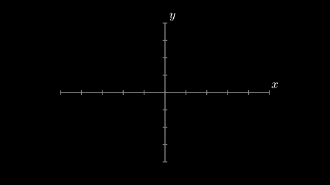
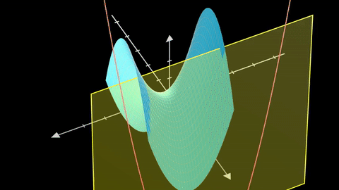

# manim turorial
manim animation library explanation and tutorial
### Tutorial 1: Basic Shapes 
<a href="https://www.bilibili.com/video/av84552858?p=1" title="Basic Shapes">Basic Shapes</img></a>
### Tutorial 2: Basic Animation
<a href="https://www.bilibili.com/video/av84552858?p=2" title="Basic Animations">Basic Animations
 
</img></a>
### Tutorial 3: Updater
<a href="https://www.bilibili.com/video/av84552858?p=3" title="Updater">Updater
 
</img></a>
### Tutorial 4: ValueTracker and OO Design
<a href="https://www.bilibili.com/video/av84552858?p=4" title="ValueTracker and OO Design">ValueTracker and OO Design
 </img></a>

### Tutorial 5: 3D scene,axes,transform matrix,surface,curves
<a href="https://www.bilibili.com/video/av84552858?p=5" title="3D scene,axes,transform matrix,surface,curves">3D scene,axes,transform matrix,surface,curves
 </img></a>